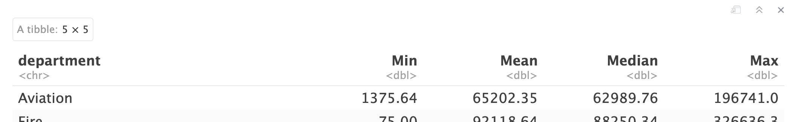

```{r include = FALSE}
source("assets/setup.R")
```

```{r photo, fig.margin = TRUE, echo = FALSE, fig.width = 3, fig.cap = "Photo of Phoenix, AZ from WikiMedia Commons", eval = TRUE}
knitr::include_graphics("img/1024px-phx-city.jpg")
```

<!-- Note: data from https://data.world/city-of-phoenix/2b41f4f8-fe6f-48d3-8097-ad44ee5bd616 -->

The City of Phoenix employs thousands of people to perform different jobs. How much does it pay them individually and in total for different departments and jobs? The priorities of a government can be shown through how it dedicates its money and personnel.

# Getting started

First, open the R Markdown document `mod-02-hw.Rmd` and knit it.

Make sure it compiles without errors. The output will be in the `.html` file with the same name.

## Warm up

Before we introduce the data, let's warm up by setting up your individual document for these exercises.

-   Update the YAML, changing the author name to your name, save and **knit** the document.

## Packages

We'll use the **tidyverse** packages for much of the data wrangling and visualization. We'll also be using `ggridges` for one of the exercises so we can just add it now. 

These packages are already installed for you.
You can load them by running the following in your Console:

```{r load-packages, eval=TRUE}
library(tidyverse)
library(ggridges)
```

## Data

The data can be found in `data` folder and read in with the following command.

```{r, eval=TRUE}
phxsal <- read_csv("data/phx-salaries.csv")
```

```{marginfigure}
**Important:** "Salary" throughout this document can be interpreted either as total annual salary or base annual salary. 
```

This data includes the salary information for every current Phoenix city employee in departments employing more than 250 people.

You can view the dataset like a spreadsheet using the `View()` function.
Note that you should **not** put this function in your R Markdown document, but instead type it directly in the Console, as it pops open a new window (and the concept of popping open a window in a static document doesn't really make sense...).
When you run this in the console, you'll see the following **data viewer** window pop up.

```{r view-data}
View(phxsal)
```

You can also view the data with the `head()` and `glimpse()` functions. These are more appropriate if you'd like to show a subset of the data itself in a notebook or report.

# Exercises

```{marginfigure}
**Hint:** The Markdown Quick Reference sheet has an example of inline R code that might be helpful. You can access it from the Help menu in RStudio.
```

1.  How many observations (rows) does the dataset have? Instead of hard coding the number in your answer, use inline code.

---

2.  Run `View(phxsal)` in your Console to view the data in the data viewer. What does each row in the dataset represent?

---

3. Show a bit of the data in your report so that readers can see the important variables. You can use either `head()` or `glimpse()` depending on which you prefer.

🧶 ✅  *Now is a good time to save and knit your document and confirm the outputs look as you expect them to.*

---

Let's now jump into some visualizations. Here is the next exercise. 

```{marginfigure}
**Remember:** "Salary" can be interpreted either as total annual salary or base annual salary. 
```

4. **PART 1:** Create a faceted histogram where each facet represents a department and displays the distribution of salaries for employees working in that department. Think critically about whether it makes more sense to stack the facets on top of each other in a column, lay them out in a row, or wrap them around. **PART 2:** Along with your visualization, include your reasoning for the layout you chose for your facets.

Before you jump in with an answer, keep reading as I give you some hints and help. Here is the code you should start with. 

```{r}
ggplot(data = ___, mapping = aes(x = ___)) +
  geom_histogram(binwidth = ___) +
  facet_wrap(~___)
```

Let's de-construct this code:

-   `ggplot()` is the function we are using to build our plot, in layers.
-   In the first layer we always define the data frame as the first argument. Then, we define the mappings between the variables in the dataset and the **aes**thetics of the plot (e.g. x and y coordinates, colours, etc.).
-   In the next layer we represent the data with **geom**etric shapes, in this case with a histogram. You should decide what makes a reasonable bin width for the histogram by trying out a few options.
-   In the final layer we facet the data by some variable (you need to specify which given the exercise instructions)

🧶 ✅  *Now is a good time to save and knit your document and confirm the outputs look as you expect them to.*

---

Now, let's dig deeper. Let's describe the distribution of salaries in the Phoenix departments that pay the most! We'll do that in the next series of four exercises:

5. Using pipelines, identify the city departments with the top five median salaries. 

```{marginfigure}
 I just wrote some pseudocode for you. Pseudocode is a way to write out the steps of a computer program using a combination of simple, easy-to-understand instructions and some programming language rules.
```

*Pseudocode for Exercise 5:*

- Start with the dataset then pipe (%>%) this into...
  - the group by function that will get department categories and then pipe (%>%) this into...
  - the summarize function to create a variable with the computed median salaries and then pipe (%>%) this into... 
  - the arrange function that takes your new variable, present it in descending order

```{marginfigure}
If you watched the lectures, you know what I mean by ridge plots. 
```

6. Using pipelines, filter the dataset to get just the five departments you identified earlier and make ridge plots of the distributions of salaries in these five departments.

*Pseudocode for Exercise 6:*

- Start with the dataset then pipe (%>%) this into...
  - a filter function that grabs all rows corresponding to the five departments then pipes (%>%) this into... 
  - a ggplot that sets up total pay on the x-axis and department on y-axis then add (+)... 
  - the geom corresponding to density ridges

7. And finally, filter the dataset to get just the five departments you identified earlier (make use of some copy and pasting), then group by each department, and then `summarize` some new variables for minimum, mean, median, and maximum salary in each of these departments. Use the visualizations from earlier and the summary statistics to describe the distribution of salaries in the departments. 

To help you out, I'm showing you the top row of what you should be outputting:

```{r data-partial, fig.width=10, fig.height=6, out.width="100%", fig.asp=NA, eval=TRUE, echo=FALSE}

```

---

Ok, moving on. Let's now take a look at how various Phoenix departments distribute their employees' regular-time, overtime, and total weekly hours worked. Whose working (too) hard? 

We can get at this with some nice and simple visualizations. Three of them, to be exact: one for `regular_hours`, one for `overtime_hours`, and one for `total_hours`

8. Go ahead and generate three simple figures that will help you tell a story about how various Phoenix departments appear to operate and how they compare to each other in terms of work schedules. You get to decide what type of visualizations to create and there is more than one correct answer! Please include a brief written interpretation of how the different departments appear to operate.

To help you you, check out a few figures you you could generate. Feel free to replicate. 

```{r, eval=TRUE, echo=FALSE}
phxsal %>% 
  ggplot(aes(y=department, x = reg_hours)) +
  geom_density_ridges()
```

```{r, eval=TRUE, echo=FALSE}
phxsal %>% 
  ggplot(aes(y=department, x = total_hours)) +
  geom_boxplot()
```

```{r, eval=TRUE, echo=FALSE}
phxsal %>% 
  ggplot(aes(x = overtime_hours/total_hours)) +
  geom_histogram() +
  facet_wrap(~department, scales="free_y") +
  labs(title = "Proportion of hours worked as overtime")
```

---

# Submitting your work

Once you are happy with the final state of your work, change the YAML `output` from `html_output` to `pdf_output.` Now knit the document to produce a final PDF file. Upload the PDF to the Canvas assignment.  
